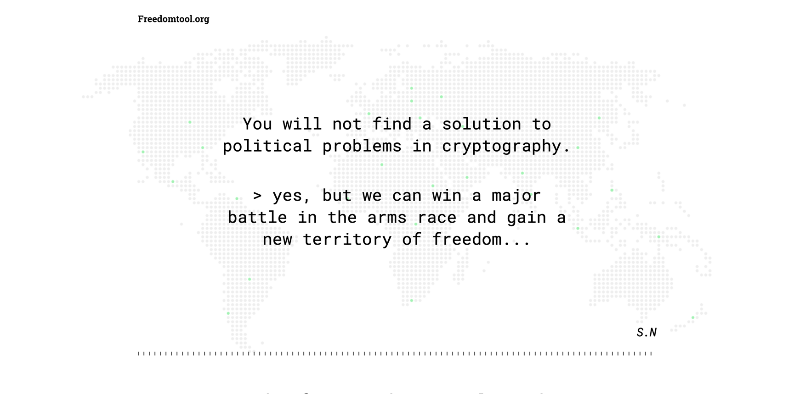

# Freedom Tool landing page



## Project setup
```
yarn install
```

### Compiles and hot-reloads for development
```
yarn start
```

### Compiles and minifies for production
```
yarn build
```

### Lints and fixes files
```
yarn lint
```

### Build docker image with version
```dockerfile
docker build --no-cache --progress=plain --build-arg BUILD_VERSION=1.0.0-rc.0 -t freedomtool .
```

### Dealing with env variables
Env variables can be rewritten by [env.is] (./static/env.js) file in runtime. To do so, we need to provide same [env variables](.env.example) there in json format
